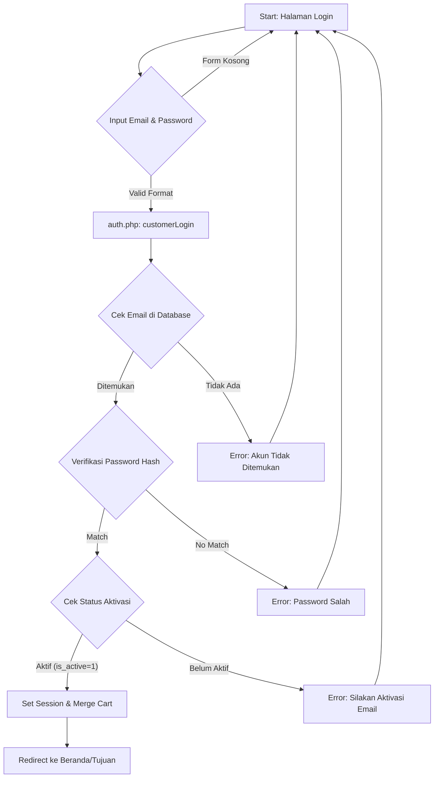
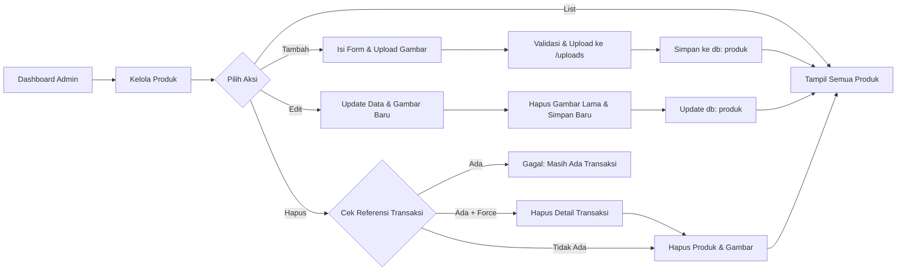

# System Flow Diagrams - MeyDa Collection

Berikut adalah visualisasi alur sistem utama menggunakan Mermaid diagram.

## 1. Login Flow (Customer)
Alur ini menjelaskan proses masuknya pelanggan ke dalam sistem, mulai dari pengisian form hingga pengalihan halaman.



---

## 2. Transaction Flow (Checkout)
Alur proses pembelian mulai dari keranjang belanja hingga konfirmasi pembayaran dan pengiriman resi.

```mermaid
graph TD
    A[Start: Halaman Keranjang] --> B{Cek Login Customer}
    B -- Belum Login --> C[Redirect ke Login]
    B -- Sudah Login --> D{Cek Kelengkapan Alamat}
    D -- Kosong --> E[Form Input Alamat]
    E -- Simpan --> D
    D -- Lengkap --> F[Pilih Metode Pembayaran]
    F -- Simulasi CC/VA --> G[Action: Checkout]
    G --> H[db: START TRANSACTION]
    H --> I[Simpan Header: transaksi]
    I --> J[Simpan Rincian: detail_transaksi]
    J --> K[Update Stok Produk]
    K --> L[Update Tabel: laporan]
    L --> M[db: COMMIT]
    M --> N[Kirim Email Resi (OrderMailer)]
    N --> O[Kosongkan Keranjang]
    O --> P[Selesai: Halaman Sukses]
```

---

## 3. Admin CRUD Flow (Product Management)
Alur bagaimana pengelola (Admin/Staff) mengelola data produk yang dijual.


