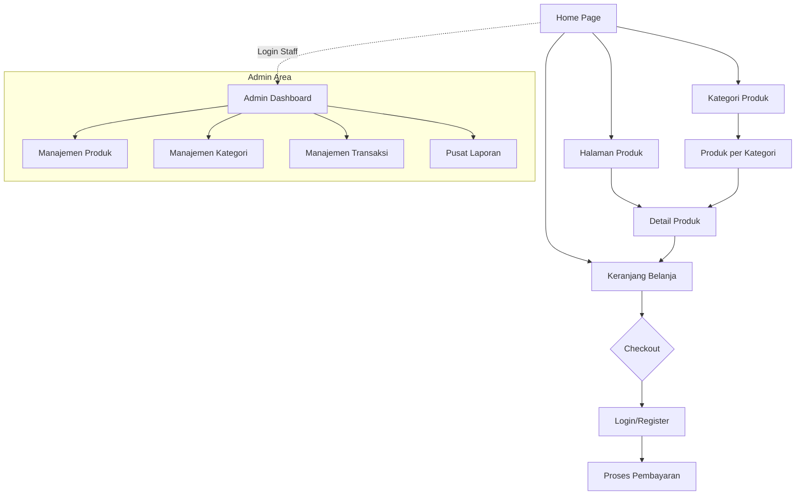

# 3.4 Struktur Navigasi Website

Berikut adalah diagram struktur navigasi website **MeyDa Collection** yang menunjukkan hierarki halaman dan alur perpindahan antar menu utama.

### Jenis Struktur: Struktur Hirarki (Hierarchical Structure)

Website **MeyDa Collection** menggunakan **Struktur Hirarki (Tree Structure)**. Ini adalah model yang paling umum untuk e-commerce karena memungkinkan pengguna berpindah dari informasi umum (Homepage) ke informasi yang sangat spesifik (Halaman Produk).

#### Mengapa Hirarki?
- **Root (Akar)** adalah halaman `index.php` (Home).
- **Cabang Utama** adalah menu navigasi seperti Produk dan Kategori.
- **Daun (Leaf)** adalah detail produk individu atau invoice transaksi.

#### Contoh Implementasi di Website:

1. **Alur Belanja (Top-Down):**
   - `index.php` (Home/Umum) $\rightarrow$ `index.php#products` (Daftar Produk) $\rightarrow$ `cart.php` (Detail Item di Keranjang).
2. **Alur Kategori:**
   - Home $\rightarrow$ Filter Kategori (Wanita/Pria) $\rightarrow$ List Produk berdasarkan Kategori Terpilih.
3. **Pemisahan Area (Sandboxed Hierarchy):**
   - **Area Publik**: Akses bebas untuk pengunjung (Home, Produk).
   - **Area Customer**: Terkunci (Login) $\rightarrow$ `account.php` (Dashboard User).
   - **Area Admin**: Folder `/admin` $\rightarrow$ `admin/dashboard.php` $\rightarrow$ `admin/products.php`.

#### Karakteristik yang Digunakan:
- **Navigasi Global**: Menu di bagian atas (Header) yang selalu muncul untuk setiap halaman utama.
- **Pengecualian (Web/Network elements)**: Meskipun hirarki, ada elemen "jaring" dimana dari halaman mana saja pelanggan bisa langsung menekan ikon **Keranjang** (akses cepat lintas level).
